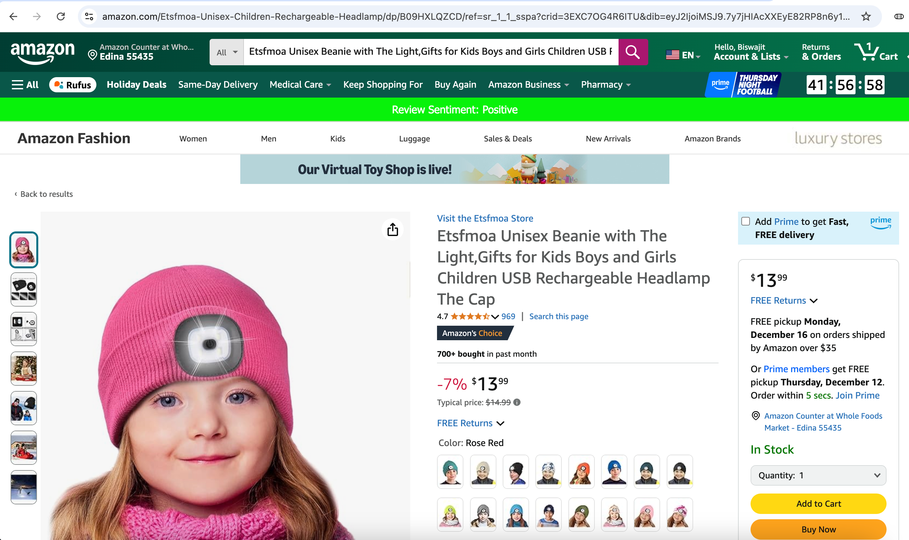

# How to use the Software

---
# Amazon Product Review Chrome Extension

Welcome to **Amazon Product Review**, a Chrome extension that performs sentiment analysis on Amazon product reviews. This tool integrates a browser extension with a backend server to provide real-time insights into customer feedback.

---

## 🛠️ Features
- Analyze sentiment of Amazon product reviews (positive, negative, neutral).
- Intuitive Chrome extension interface.
- Powered by backend TextMining for advanced sentiment analysis with key phrases from review comments, charts and review trends.

---

## 📂 Repository Structure
1. **ChromeExtension**: Contains the source code for the Chrome extension.
2. **TextMining**: Backend server code that processes sentiment analysis.

GitHub Repository: [Amazon Product Review](https://github.com/palbiswa/AmazonProductReview)

---

## 🚀 Installation Guide

### Step 1: Clone the Repository
1. Clone this repository using Git:
   ```bash
   git clone https://github.com/palbiswa/AmazonProductReview.git

Navigate to the project directory:
```bash
    cd AmazonProductReview
```

### Step 2: Set Up the Chrome Extension
1. Open Google Chrome and go to chrome://extensions/.
2. Enable Developer mode by toggling the switch at the top-right.
3. Click Load unpacked and select the ChromeExtension folder from the cloned repository.
4. The extension will now appear in your browser toolbar as Amazon Product Review.

### Step 3: Set Up the Backend Server
1. Navigate to the TextMining directory:
```bash
   cd TextMining
```   
2. Install required dependencies. 
   For example install the corresponding packages like nltk,flask, CORS,TextBlob, VaderSentiment and related packages mentioned in python code.
3. Start the backend server using ProductAnalyserApp.py. This is the flask class which will run the server to receive REST API request from Chrome extension
4. Ensure the server is running and accessible. If it runs properly it will show the following like in console.
 INFO:werkzeug:WARNING: This is a development server. Do not use it in a production deployment. Use a production WSGI server instead.
 * Running on all addresses (0.0.0.0)
 * Running on http://127.0.0.1:5001
 * Running on http://192.168.0.11:5001
INFO:werkzeug:Press CTRL+C to quit


### Step 4: Configure the Chrome Extension
Open the Chrome extension settings by clicking the extension icon.

## Usage Guide
Analyze Amazon Product Reviews
1. Open Amazon home page page.
2. Navigate to any one specific product page where user have some reviews. Here in the example I searched SONY TV and went to a product page where I can see user reviews.
Here is screen for an example.

3. If you scroll up you will see a green banner on the top of this same page, which is showing
review sentiment for this product based on user reviews mentioned in this page. This triggers the extension on page load to show upfront feedback.
Here is the example screen shot.
.
4. If Sentiment is different it will show accordingly based on following logic.
```bash
   if polarity < -0.5:
            return "Strongly Negative"
        elif polarity > -0.5 and polarity < 0:
            return "Negative"
        elif polarity == 0:
            return "Neutral"
        elif polarity > 0 and polarity < 0.5:
            return "Positive"
        else:
            return "Strongly Positive" # polarity > 0.5
```
4. If want to see details review about the product then click on the extension Amazon Product Review as mentioned in bellow screenshot to open the extension pop up.
.
5. It will open a pop up and show Product Review insights.
.
6. Here user can select two different model to generate sentiment level bar chart and date wise sentiment trends based on available data present in amazon real LIVE page
and able to get key phrases based on the review comments posted on Amazon page for this product.

### 🔧 Troubleshooting
1. Issue: Extension not loading
      1. Ensure you loaded the ChromeExtension folder. 
      2. Check for a valid manifest.json file.
2. Issue: Backend server not working
      1. Ensure Python dependencies are installed.
      2. Verify the server is running at http://127.0.0.1:5001


## How the software is implemented.

---

## Overview
**Amazon Product Review** is a Chrome extension integrated with a backend server for performing sentiment analysis on Amazon product reviews. The project is designed to extract review data from Amazon's product pages and process it through natural language processing (NLP) techniques to provide users with actionable insights.

---

## Features
- Extracts customer reviews directly from Amazon product pages.
- Performs sentiment analysis to classify reviews as Positive, Negative, or Neutral.
- Displays summarized results in the browser.

---
## Project Structure
The repository contains two primary components:

1. **ChromeExtension**
   - A browser extension written in JavaScript, HTML, and CSS.
   - Responsible for interacting with Amazon's webpage to collect review data.
   - Sends review data to the backend for processing.

2. **TextMining**
   - A backend service implemented to process reviews using NLP techniques.
   - Classifies sentiments and returns results to the extension.
   - Built using Python and uses libraries such as `NLTK`, `TextBlob`, or `Vader Sentiment`.

---

## Implementation Details

### 1. Chrome Extension
- **Technologies Used**: JavaScript, HTML, CSS
- **Key Functionalities**:
  - Scrapes review data from the product page using DOM manipulation.
  - Sends HTTP requests to the backend server with the extracted data.
  - Displays the sentiment analysis results directly in the browser main page and extension pop up.
  - D3.JS is used for charts

### 2. Backend (TextMining)
- **Technologies Used**: Python
- **Key Functionalities**:
  - Implements RESTful APIs to communicate with the Chrome extension.
  - Processes the review data using sentiment analysis algorithms.
  - Returns JSON responses with sentiment classification.

## How It Works
1. The Chrome extension scrapes reviews from the active Amazon product page.
2. The extension sends the extracted data to the backend server via a POST request.
3. The backend processes the reviews and performs sentiment analysis.
4. The analysis results are sent back to the extension and displayed in the browser.
5. You can look into the implementation from the github code. Here is the quick snapshots of the file structure.

- UI Code Files

.

- Python Text Mining Backend Code Files

.
   

---
## Evaluation

Collected few sample Amazon pages with review to test the software.
And used it to test the software. Below is our findings.

Sample Amazon Product ReviewTest Pages:

# Test Pages for Amazon Product Review Chrome Extension

This table categorizes Amazon product review pages as Positive, Negative, and Blank for testing the sentiment analysis capabilities of the Chrome extension. Each entry includes sentiment feedback provided based on human judgment.

## Positive Amazon Review Pages for Testing

| Product Name                                                                                          | URL                                                                                                                                                                                                                     | Sentiment Feedback  |
|-------------------------------------------------------------------------------------------------------|-------------------------------------------------------------------------------------------------------------------------------------------------------------------------------------------------------------------------|---------------------|
| Hasbro Gaming Connect 4 Classic Grid, Strategy Board Games for Kids                                   | [Amazon Link](https://www.amazon.com/Legendary-Whitetails-Flannels-Cedarwood-Plaid/dp/B01K0ETB6E/?_encoding=UTF8&pd_rd_w=DJosc&content-id=amzn1.sym.aeef70de-9e3e-4007-ae27-5dbb7b4a72f6&pf_rd_p=aeef70de-9e3e-4007-ae27-5dbb7b4a72f6&pf_rd_r=13RRJ49ZRXYE0BK2CAE8&pd_rd_wg=4vxlk&pd_rd_r=c4fa0248-5612-44f4-801d-59c46d7b527a&ref_=pd_hp_d_btf_crs_zg_bs_7141123011) | Mostly Positive    |
| Apple Watch Series 10 Smartwatch with Jet Black Aluminium Case                                        | [Amazon Link](https://www.amazon.com/Apple-Watch-Smartwatch-Aluminium-Always/dp/B0DGHQ2QH6/?_encoding=UTF8&pd_rd_w=DJosc&content-id=amzn1.sym.aeef70de-9e3e-4007-ae27-5dbb7b4a72f6&pf_rd_p=aeef70de-9e3e-4007-ae27-5dbb7b4a72f6&pf_rd_r=13RRJ49ZRXYE0BK2CAE8&pd_rd_wg=4vxlk&pd_rd_r=c4fa0248-5612-44f4-801d-59c46d7b527a&ref_=pd_hp_d_btf_crs_zg_bs_7141123011)                                                                                                                                            | Positive (High satisfaction levels) |
| Crocs Unisex-Adult Classic Clogs                                                                      | [Amazon Link](https://www.amazon.com/Stanley-IceFlow-Stainless-Steel-Tumbler/dp/B0CT4BB651/?_encoding=UTF8&pd_rd_w=0sCqo&content-id=amzn1.sym.aeef70de-9e3e-4007-ae27-5dbb7b4a72f6&pf_rd_p=aeef70de-9e3e-4007-ae27-5dbb7b4a72f6&pf_rd_r=13RRJ49ZRXYE0BK2CAE8&pd_rd_wg=4vxlk&pd_rd_r=c4fa0248-5612-44f4-801d-59c46d7b527a&ref_=pd_hp_d_btf_crs_zg_bs_284507&th=1) | Positive (Comfortable and reliable) |

## Negative Amazon Review Pages for Testing

| Product Name                                                                                          | URL                                                                                                                                                                                                                     | Sentiment Feedback                      |
|-------------------------------------------------------------------------------------------------------|-------------------------------------------------------------------------------------------------------------------------------------------------------------------------------------------------------------------------|-----------------------------------------|
| BLACK+DECKER 3-in-1 Waffle Maker with Nonstick Reversible Plates                                      | [Amazon Link](https://www.amazon.com/LEVOIT-Purifier-Allergies-Eliminator-Warranty/dp/B07GKVS2N8/)                                                                               | Negative (Complaints about durability) |
| Chicken Mask                                                                                          | [Amazon Link](https://www.amazon.com/Jumlys-Plastic-Fillable-Colorful-Stuffers/dp/B0CP7Y8NMR/ref=pd_sim_hxwPM2_sspa_dk_detail_p0_og_d0?pd_rd_w=dbvOV&content-id=amzn1.sym.8731cf14-a5af-469f-9ca4-1f4799dd0e7c&pf_rd_p=8731cf14-a5af-469f-9ca4-1f4799dd0e7c&pf_rd_r=T3AFDT2C0VV6V8CEY0Q1&pd_rd_wg=x5wHC&pd_rd_r=10a802bc-1d8e-467f-9723-ddf7a5d1cac8&pd_rd_i=B0CP7Y8NMR&psc=1) | Negative (Poor design and material)    |
| Party Favors                                                                                          | [Amazon Link](https://www.amazon.com/Plastic-Fillable-Colorful-Perfect-Stuffers/dp/B0CNGTK8X9/)                                                                                  | Negative (Low-quality items)           |

## Blank Reviews

| Product Name                                                                                          | URL                                                                                       | Sentiment Feedback                      |
|-------------------------------------------------------------------------------------------------------|-------------------------------------------------------------------------------------------|-----------------------------------------|
| Exercise Sarcasm Novelty T-Shirt                                                                      | [Amazon Link](https://www.amazon.com)                                                    | Blank (No substantive reviews)         |

